# Занятие 4
## Изучение основных свойств ДПФ с помощью моделирования в  Python/Spyder

**Цель работы:**
Целью работы является изучение основных свойств дискретного преобразования Фурье с помощью моделирования в среде Python/Spyder.

**Задание**
1. Для заданных значений частоты сигнала и частоты дискретизации получите дискретное колебание, отсчеты посмотрите в Variable Explorer. Далее увеличьте частоту сигнала в несколько раз, при этом так же увеличится и частота дискретизации, но отношение частоты сигнала и частоты дискретизации - нормированная частота останется той же величиной.
Сравните дискретные отсчеты первого и второго сигналов.

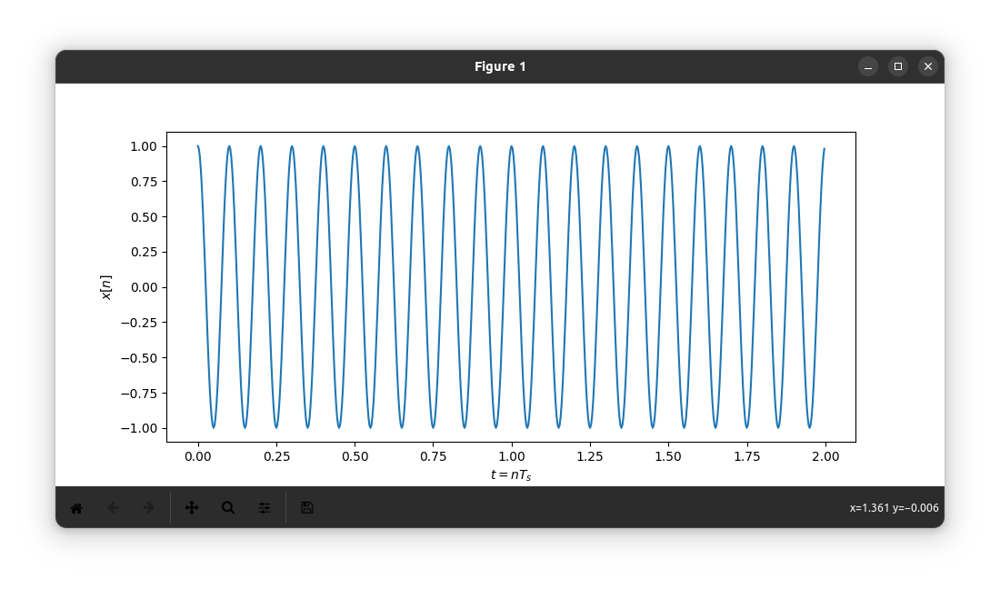
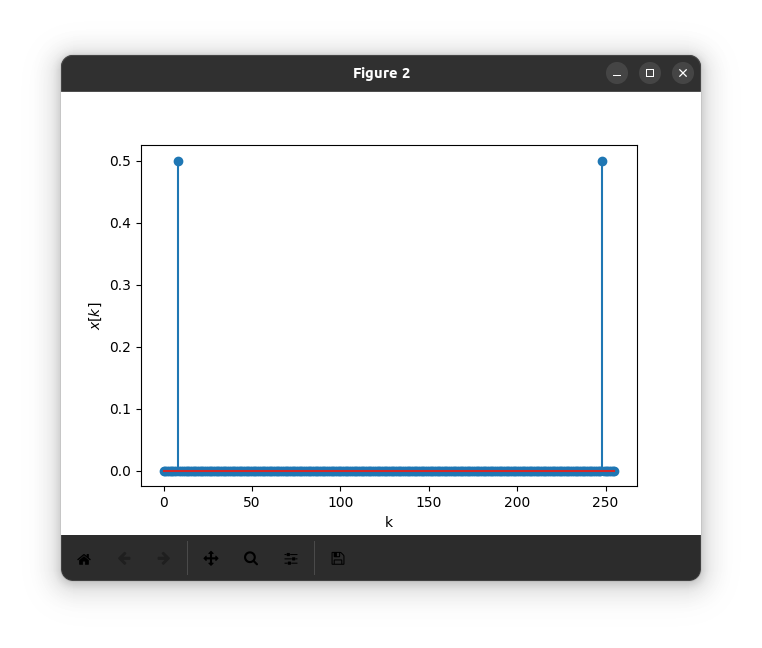
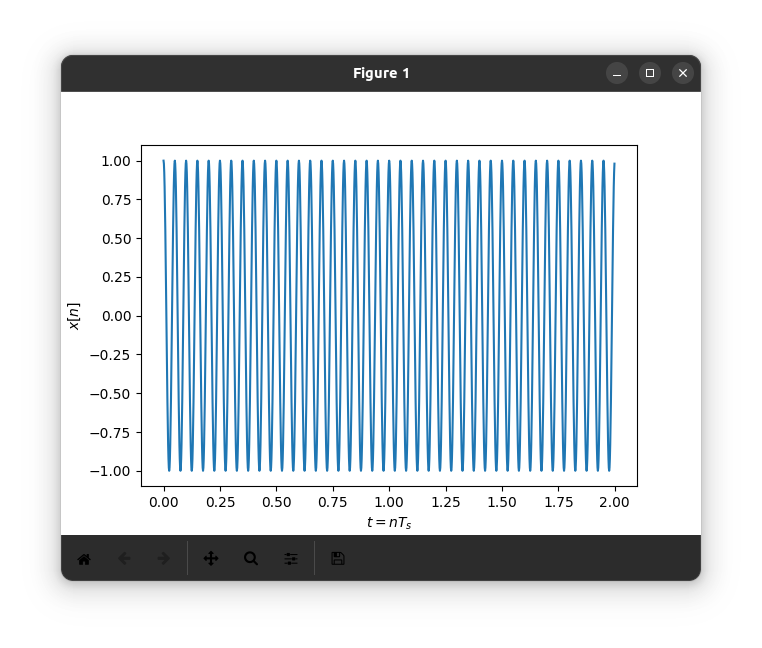


2. Вычислите шаг частот между точками ДПФ ∆f =fs/N. Определите, в  какой точке ДПФ находится заданный сигнал.

```sh
∆f=320/256=1.25
```

3. Измените частоту сигнала в целое чисто раз,определите номер точки ДПФ для данного сигнала.

```sh
∆f=320/256=1.25
```

4. Измените количество точек ДПФ до 512. Вычислите шаг частот между точками ДПФ ∆f = fs/N. Определите, в какой точке ДПФ находится заданный сигнал. (файл 4.py)

```sh
∆f = fs/N = 320/512=0.625
```

5. Задайте сигнал в виде суммы двух колебаний.Вычислите ДПФ сигнала.(файл 5.py)

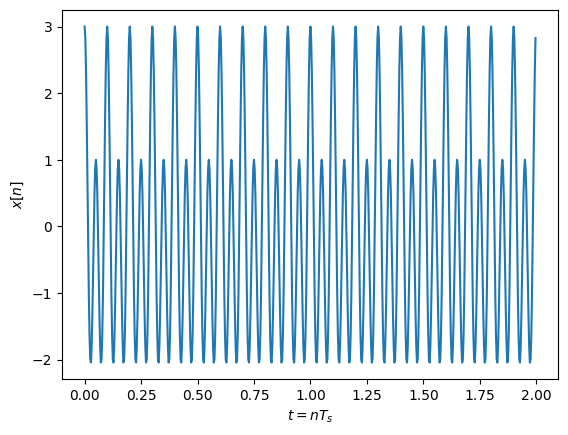

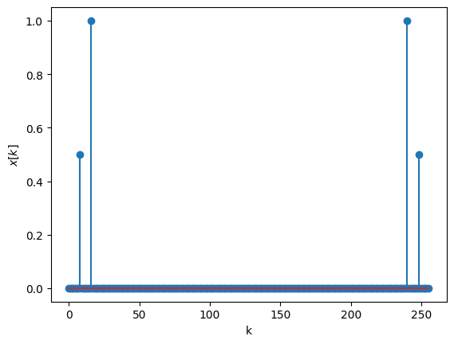

6. Вычислите ОДПФ сигнала, заданного в частотной области в виде X=np.array([0,0,1,0,0,0,0,0]).

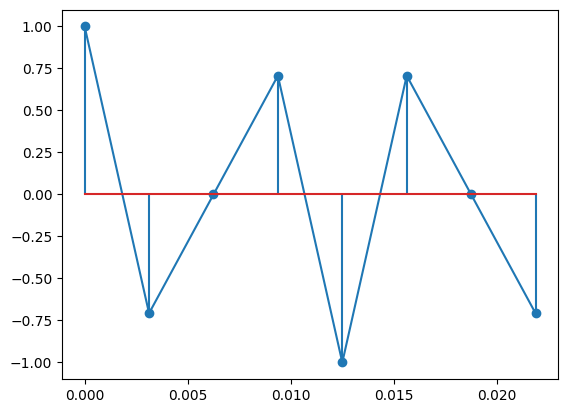

Задавайте ненулевое значение в различных разрядах.

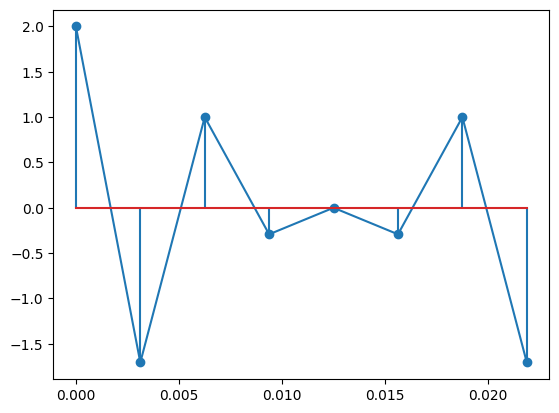

Также задайте значение в комплексной форме X=np.array([0,0,1j,0,0,0,0,0]).
 
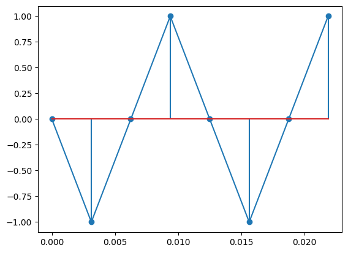
 
Поменяйте знак мнимой единицы.

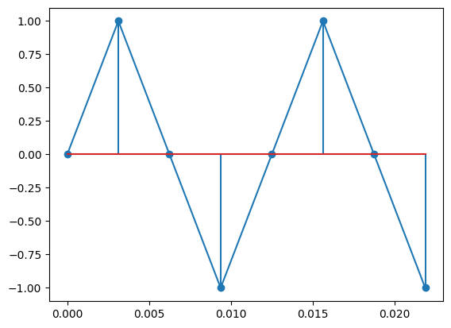

Задайте спектр ДПФ в виде X=np.array([0,0,2-1j,0,0,0,0,0]) поменяйте знак мнимой 

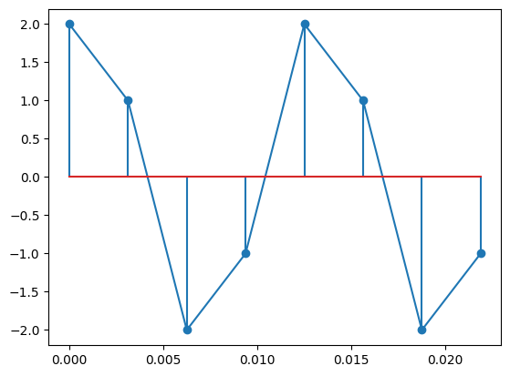

## Работа с SDR

Получен спектр сигнала изменяющегося во времени

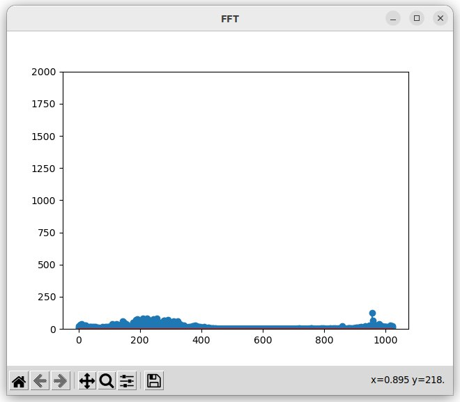
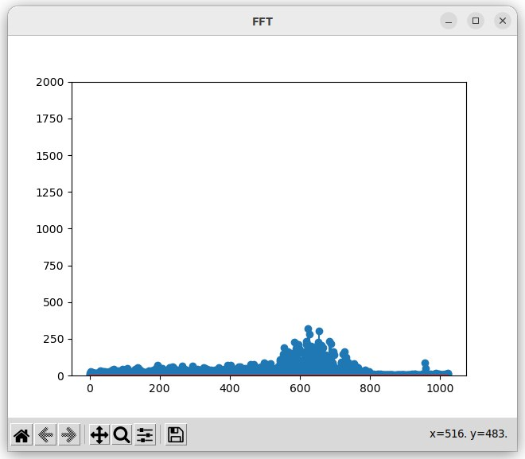


