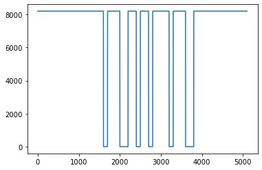
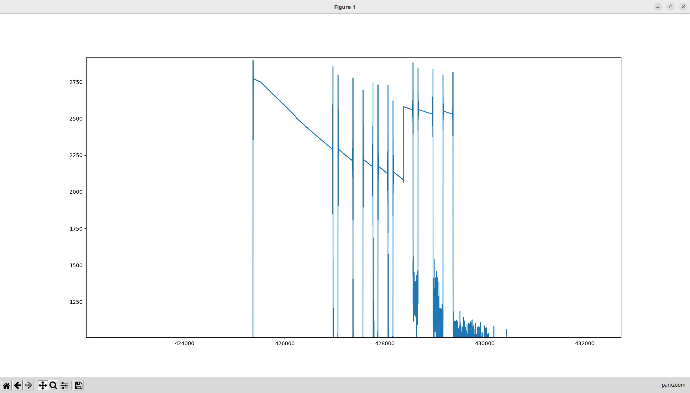

# Занятие 6
## Амплитудная модуляция. Передача\прием прямоугольного сигнала (Ч1)

**Задача:** необходимо передать “информацию” по радиоинтерфейсу при помощи амплитудной модуляции. Далее,принять радиосигнал при помощи метода sdr.rx(), демодулировать его, вывести на экран полученную "информацию".

Передаваемый прямоугольный сигнал

Полученная битовая последовательность

Пока без дешифровки
