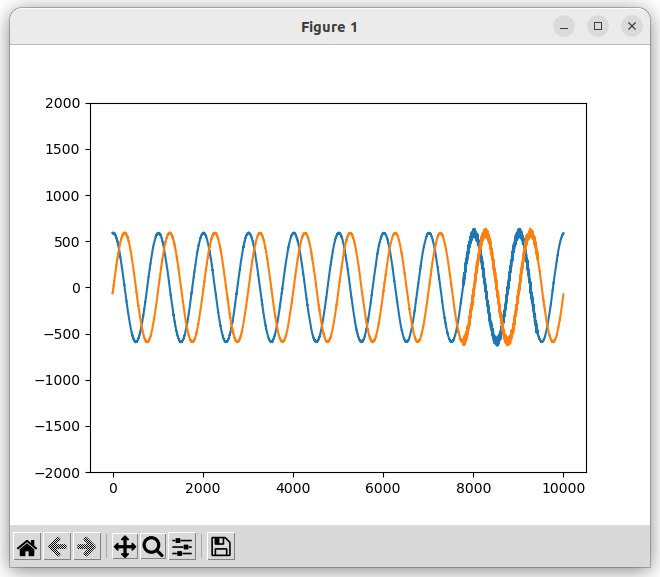
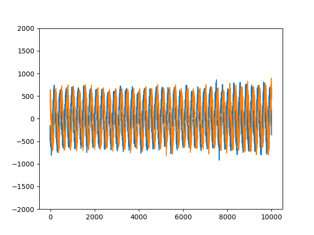
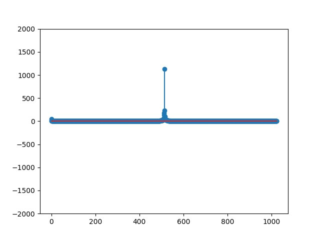
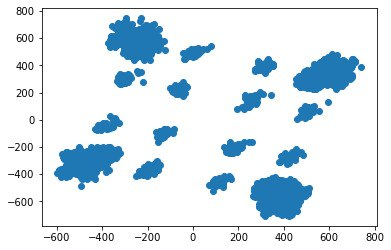

# Занятие 7
## Модуляции QPSK, QAM. Раздельный приём и передача на SDR


**Задача 1**. Передайте синусойду в рамках одного ADALM Pluto SDR. Выведите графики отправленного и принятого в итоге графика.

1) Генерируемые вами значения должны быть комплексными, а значит, необходимо формировать две составляющие, реальную и мнимую. Например:
```sh
i = np.cos(2 * np.pi * t * fc) * 2 ** 14
q = np.sin(2 * np.pi * t * fc) * 2 ** 14
```

2) Не забываем, что нужно задать частоту, и ось временных отсчетов на которой будут генерироваться наши значения синусойды (рекомендуется связать *fc* и *sample rate*)

3) Значения отправляем на наш передатчик, незабываем, что они должны быть комплексными. (`samples = i + 1j * q`)


Прием и передача синусоид на одной SDR

**Задача 2.** Попробуйте организовать полудуплексную передачу. Допустим, на вашей SDR будет реализован передатчик, а у соседа - приёмник. 

Для этого требуется правильно прописать код, чтобы он реализовывал только передатчик или только приемник.



Опциональная задача. Постройте спектр принятого сигнала, что в нем примечательного?


**Задача 3**. Сгенерировать QPSK-модулированный сигнал при помощи одного ADALM PLuto в режиме полного дуплекса.


Получена QPSK модуляция в режиме полудуплексной передачи

1) Выведите спектр полученного сигнала. Зафиксируйте график в отчет. Чем он отличается от полученного ранее для синусоиды?

(Пока нет скринов)

2) Постройте график временной области, для сэмплов, отправляемых на передачу. Зафиксируйте.

(Пока нет скринов)
