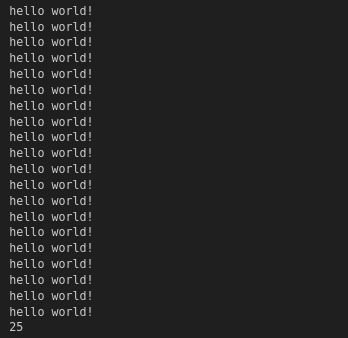
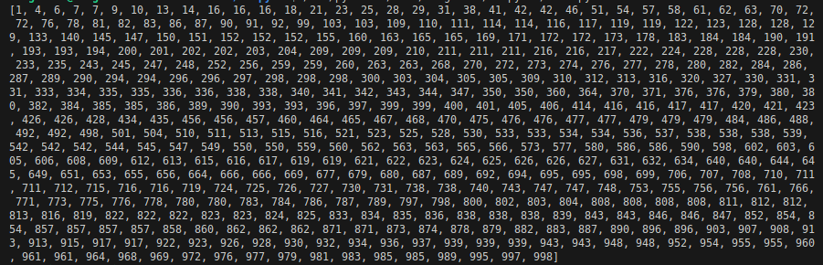
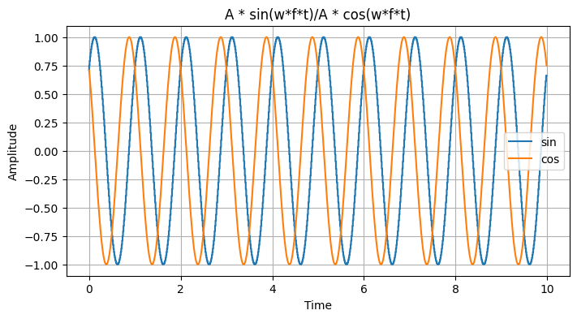

# Занятие 1
## Временная и частотная область обработки, сигналы

Задание:

- Форматированный вывод данных

    Вывести на экран 20 копий предложения “Hello World!” при помощи команды print().
    При помощи команды input() ввести с клавиатуры целочисленное число, возвести его во 2 степень и вывести результат на экран.

- Массивы

    Сгенерировать массив случайных чисел размером 1024 в пределах [-1000:1000].
    Отсортировать данный массив.
    Удалить все отрицательные числа.

- Изучение Matplotlib

    Сгенерировать массив значений по синусоидальному закону, размер массива должен быть больше 1000, частоту, начальную фазу и амплитуду задать фиксированными значениями;
    Вывести значения массива на графике;
    Подписать оси графика (амплитуда, время);
    Подписать сам график - “A * sin(wft)”;
    Добавить в этот же график аналогичный график, но с косинусом;

Результаты работы:

- Вывод 20 копий предложения “Hello World!” и числа, возведенного в степень 2 

- Вывод отсортированного массива без отрицательных чисел

- Сгенерированные синус и косинус

