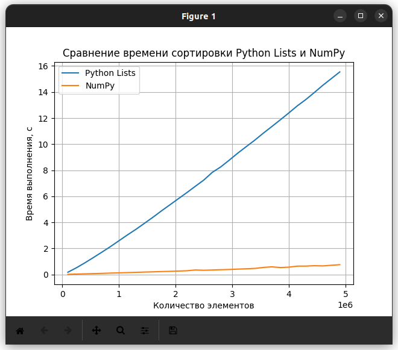
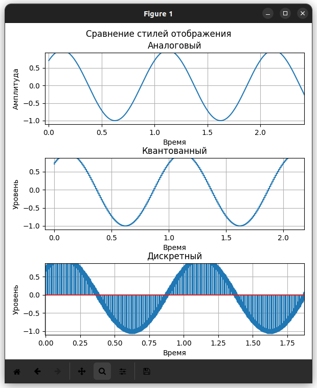

# Занятие 2
## Формирование сигналов, визуализация в Python

Задание:

- Сравнение скорости работы lists и NumPy

    Сравнить время выполнении функции сортировки для Python Lists и NumPy
    Вывести на графике зависимость времени выполнения операции сортировки (ось Y) от количества элементов (ось X). Количество элементов считать от 10 до 5000000 c шагом примерно от 100000 до 300000.
    Подписать на графике название осей.
    Загрузить результат исследования на Github

- Создание графиков с различным стилем отображения

    Изучить базовые функции библиотеки matplotlib
    Создать 2 дополнительных графика со стилями:
        В виде отсчетов (используя функцию stem)
        В виде квантованных уровней (функция step)
    Дать название каждому графику:
        “Аналоговый”
        “Дискретных”
        “Квантованный”
    Добавить к фону графика “сетку” масштаба (grid)
    Подписать название осей.
    Объединить 3 графика в одной картинке (fig)
    Загрузить результат на GitHub

Выполнение:

- Сравнение скорости работы lists и NumPy

- Графики с различным стилем отображения

