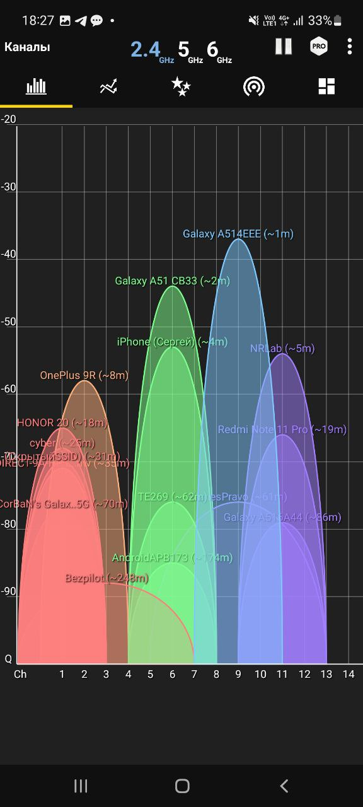
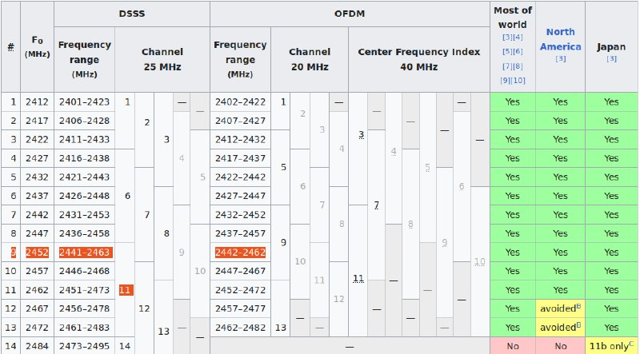
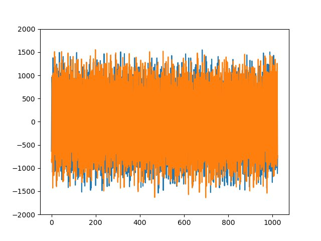
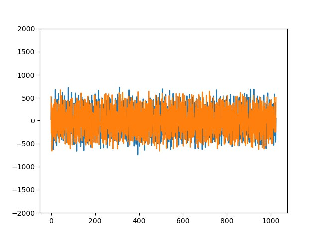
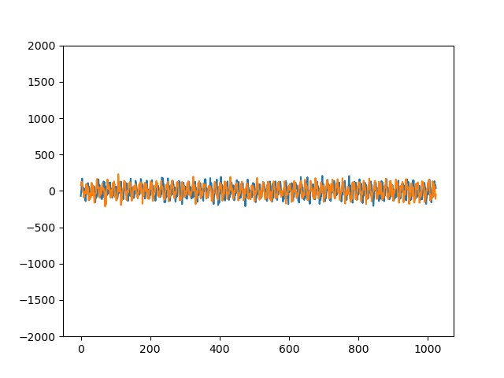

# Занятие 3
## Изучение основных параметров библиотеки PyAdi для Adalm Pluto SDR


- Используя приложение  **WifiAnalyzer**, нашли канал c наиболее мощной точкой доступа. На скриншоте можно увидеть, что это **GalaxyA51IEEE**, 9 канал



- Открываем [список каналов WLAN](https://en.wikipedia.org/wiki/List_of_WLAN_channelshttps://en.wikipedia.org/wiki/List_of_WLAN_channels) в диапазоне частот 2.4 ГГц. Частота нашего канала равна **2452 МГц**



- Код самой программы:

```sh
import time
import adi
import matplotlib.pyplot as plt
import numpy as np

# Create radio
sdr = adi.Pluto("ip:192.168.2.1")

# Configure properties
sdr.rx_lo = 2452000000

# Collect data
for r in range(60):
    rx = sdr.rx()
    plt.clf()
    plt.plot(rx.real)
    plt.plot(rx.imag)
    plt.ylim([-2000, 2000])
    plt.draw()
    if rx.imag[10] > 200:
    	time.sleep(5)
    plt.pause(0.05)
    time.sleep(0.1)
    
plt.show()
```

- Полученный результат:








