# Занятие 5
## Изучение основных свойств сигналов с амплитудной модуляцией (АМ)

**Цель работы:**
Целью работы является изучение основных свойств сигналов с амплитудной
модуляцией (АМ) с помощю моделирования в среде Python/Spyder

**Задание**
1. Для заданных значений параметров несущего колебания и НЧ сигнала
определите значение частоты дискретизации (в менеджере переменных), значение индекса АМ. Получите временную и спектральную диаграммы несущего колебания и НЧ сигнала.

``` sh
fs = 204.7

АМ mu=0.5
```

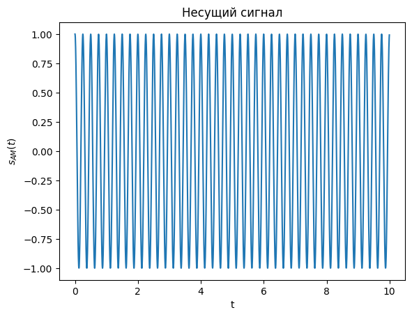
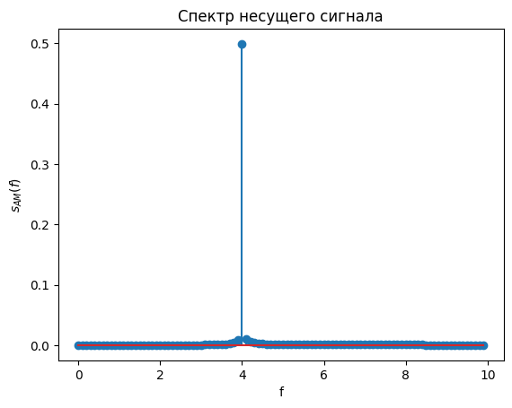
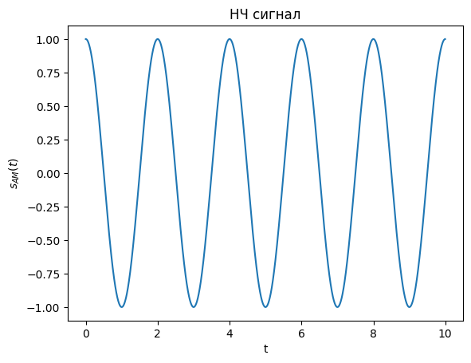
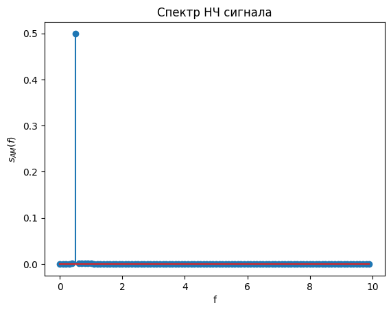

2. Получите сигнал АМ с параметрами fc = 4, fm = 0.2, Ac = 2 , Am = 0.5.

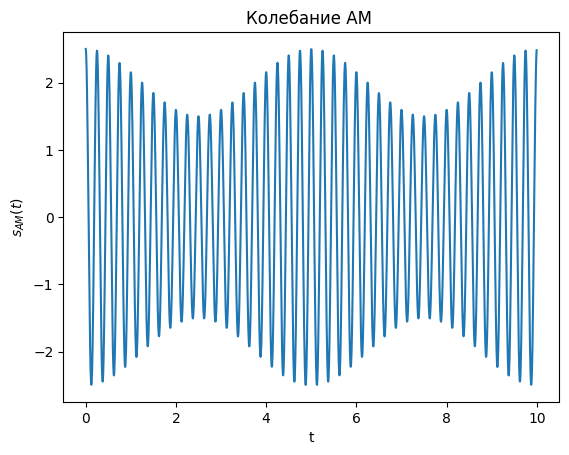

Получите временную и спектральную диаграммы несущего колебания и НЧ сигнала.


Определите нормированную частоту среза ФНЧ fn в менеджере переменных. 
```sh
fn = 0.000977
```

Попробуйте изменить ее значение (задайте в программе fn) и сравните качество дететирования.

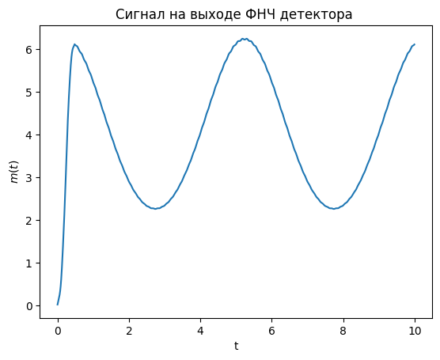
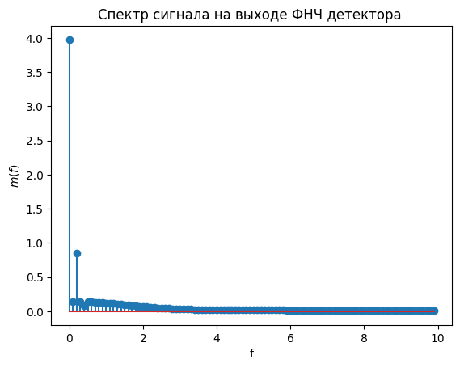
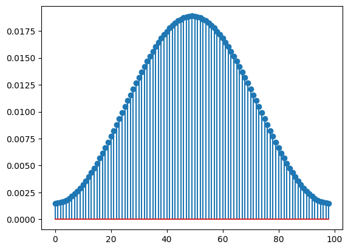

Задала fn = 60 * fm/fs
ФНЧ работает с помехами

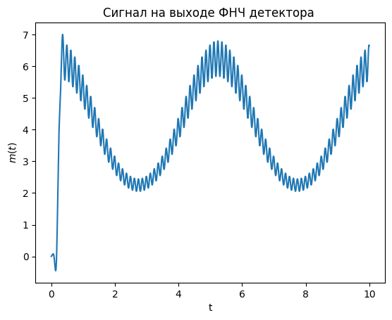
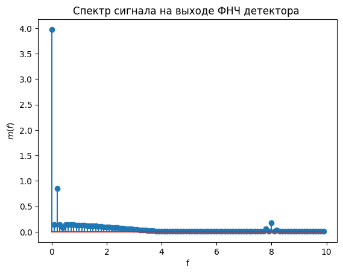
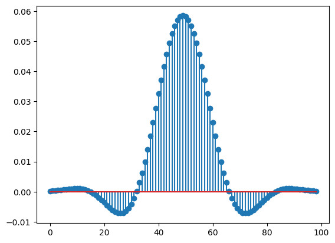

3. Получите сигнал АМ с параметрами fc = 2, fm = 0.2, Ac = 2 , Am = 1.5.

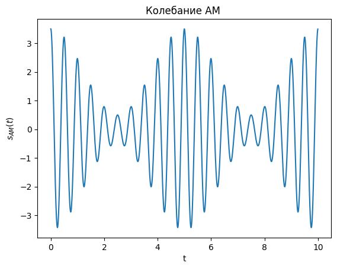

Получите временную и спектральную диаграммы несущего колебания и НЧ сигнала.

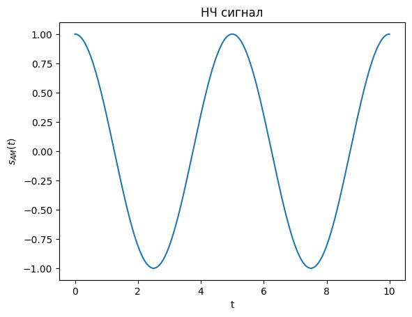
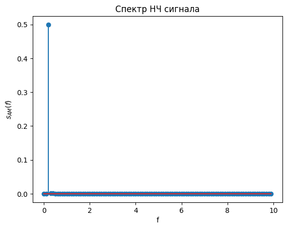
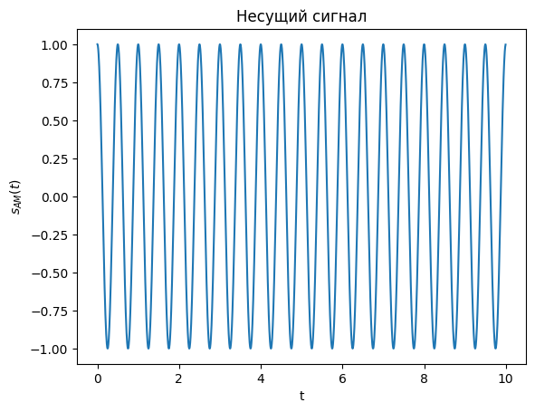
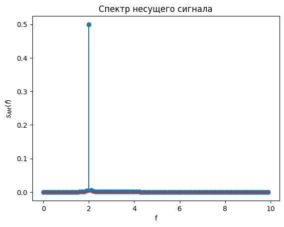

Определите нормированную частоту среза ФНЧ fn в менеджере переменных. 

```sh
fn = 0.000977
```

Попробуйте изменить ее значение (задайте в программе fn) и сравните качество дететирования.

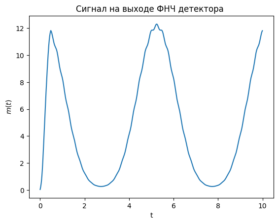
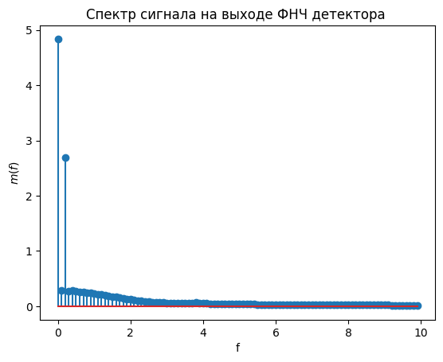


Задала fn = 60 * fm/fs
ФНЧ также работает с помехами

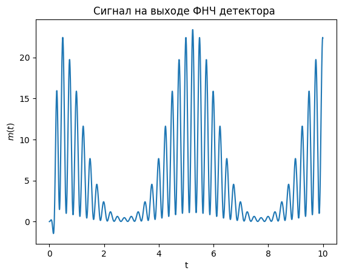
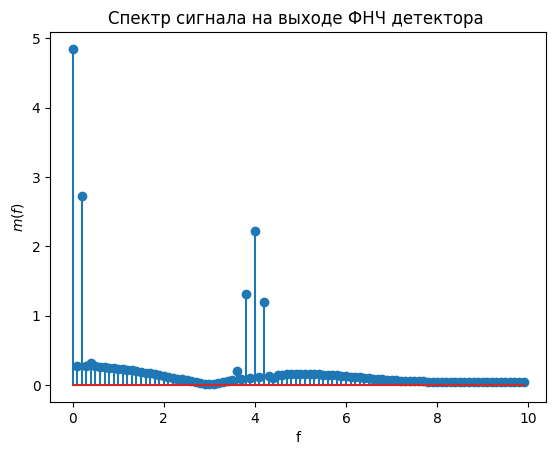


## Передача/прием sin() сигнала. Реализация АМ модуляции. PlutoSDR.

**Задание 1**

1. По умолчанию, количество сэмплов, получаемых с буфера, равно **1024**.
2. Сгенерируйте прямоугольный сигнал:
    a. Количество элементов вектора - на свое усмотрение (но не больше **1024**);
    b. Макс. амплитуда может быть равна **2**14;**
3. Отправьте сгенерированные сэмплы синусоиды на функцию передатчика;
4. Накопите принятый сигнал в векторе, который будет равен значению `.sample_rate`.
5. Отобразите на графике полученный вектор;

**Задание 2**

1. Установите размер **1 символа** - на свое усмотрение.
2. При помощи **ASCII** таблицы (кодировщика) закодируйте свои данные (ФИО) в виде битовой последовательности.
3. При помощи изменения максимальной амплитуды радиосигнала сформируйте синусоиду (из Задания №1) по правилам амплитудной модуляции. Уровни модуляции для `“0”` и `“1”` установите опытным путем.
4. Передайте ваши данные на `tx()` и “**примите + декодируйте**” на стороне `rx()`. 
5. Опишите с какими проблемами вы столкнулись во время выполнения задания и как их решили.
