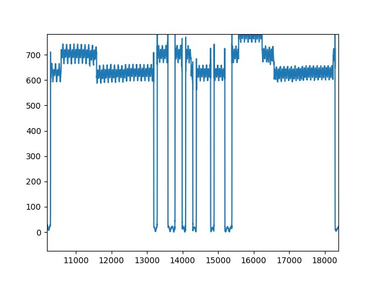

# Занятие 8
## Амплитудная модуляция. Передача\прием прямоугольного сигнала (Ч2)

**Задача**: необходимо передать “информацию” по радиоинтерфейсу при помощи амплитудной модуляции. Далее, принимающая сторона получает радиосигнал при помощи метода sdr.rx(), демодулирует его, выводит на экран полученную “информацию. 

Под “**информацией**”, в данном случае, будем понимать заранее выбранное слово, набранное при помощи латинских букв в кодировке “ASCII”

Закодировала слово "sos"

```sh
bits = np.array([1,1,1,1,1,1,1,1,1,1,1,1,1,1,1,1,   
                 0,1,1,1,0,0,1,1,   
                 0,1,1,0,1,1,1,1,   
                 0,1,1,1,0,0,1,1,  
                 1,1,1,1,1,1,1,1,1,1,1]) 
```
(Первые 16 символов и последние 11 - синхронизирующие сигналы)

Передаваемый прямоугольный сигнал


Принятый сигнал(с небольшими искажениями)





Дешифровка сигнала пока в процессе...
