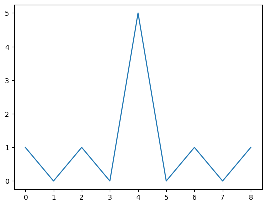
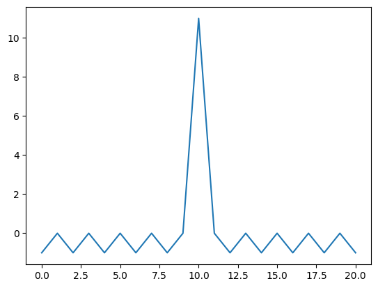
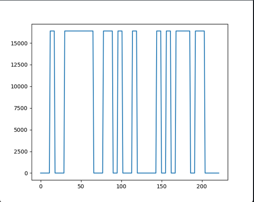

# Занятие 10
## Квадратурная IQ модуляция. Общая схема формирования и приема сигналов с дискретной модуляцией. Дискретная АМ, формирование символов в формирующем фильтре, прием сигналов.

**Задание**: 
- Изучить корреляцию кода Баркера 

код Баркера из 5 значений

```sh
x = np.array([+1, +1, +1, -1, +1]) # код Баркера из 5 значений
y = np.correlate(a,a,'full') # подсчёт корреляции
```


код Баркера из 11 значений

```sh
x = np.array([+1, +1, +1, -1, -1, -1, +1, -1, -1, +1, -1]) # код Баркера из 11 значений
y = np.correlate(a,a,'full') 
```


- Рассмотреть сигнал из лекции. Передать и получить его.

Переданные значения


 
 

