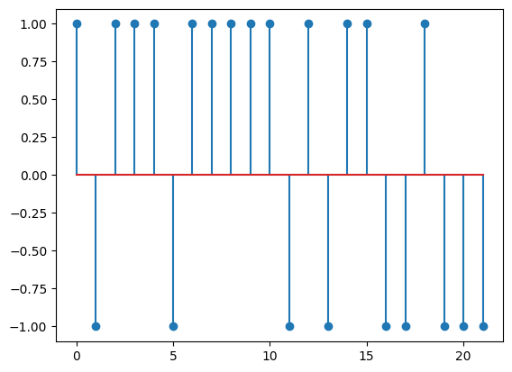
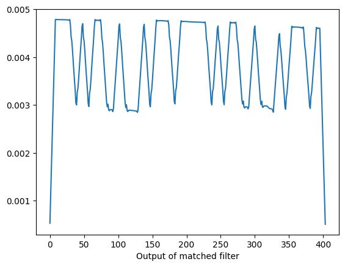
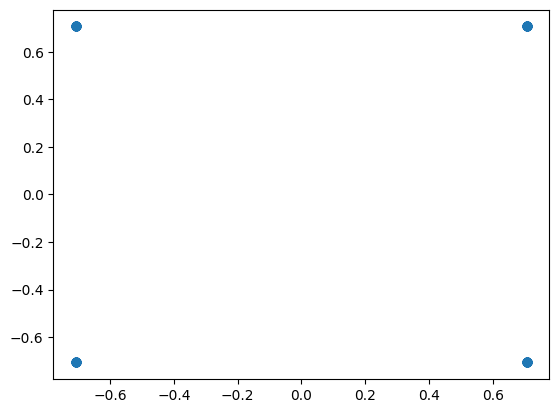
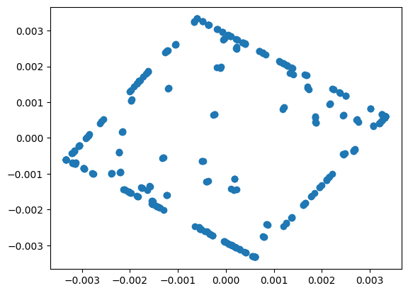

# Занятие 11
## Квадратурная IQ модуляция. Общая схема формирования и приема сигналов с дискретной модуляцией. Дискретная АМ, формирование символов в формирующем фильтре, прием сигналов

**Задание**: 
- Передать и получить АМ сигнал
- Передать и получить QPSK модулированный сигнал

## AM модуляция

- Непреобразованные отправленные отсчеты

- Принятый сигнал после свертки

## QPSK

- Отправленные qpsk отсчеты 

- Принятый QPSK сигнал

