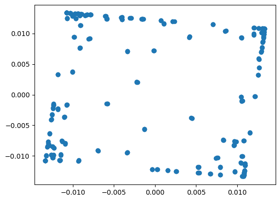
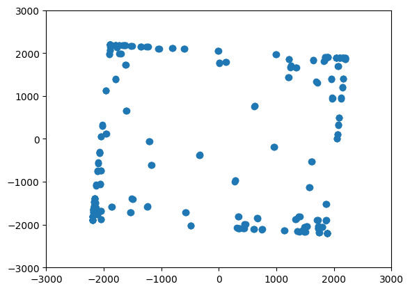

# Занятие 12
## Частотная синхронизация, грубая и тонкая

**Задание**: 
- Реализовать грубую (первоначальную) коррекцию частотного смещения

Принятый сигнал




```py
xrec = xrec1**4 # возведение в степень qpsk
xrec2 = fft(xrec,size) # вычисляем ДПФ для определения смещения частоты
xrec2 = fftshift(xrec2) # сдвигаем к 0 

w = np.linspace(-np.pi,np.pi,size)# задаем область -pi до pi

max_f = np.argmax(abs(xrec2))# индекс максимального значения 
max_index = w[max_f] # номер ДПФ в значение нормированной частот

ph = max_index/4 
phlc = np.exp(-1j*ph) # корректирующий сигнал как комплексную экспоненту
qpsk_ph = xrec1 *phlc # умножаем сигнал на наши отчеты
```

Повернутый сигнал



Сигналы разворачиваются на случаный угол
