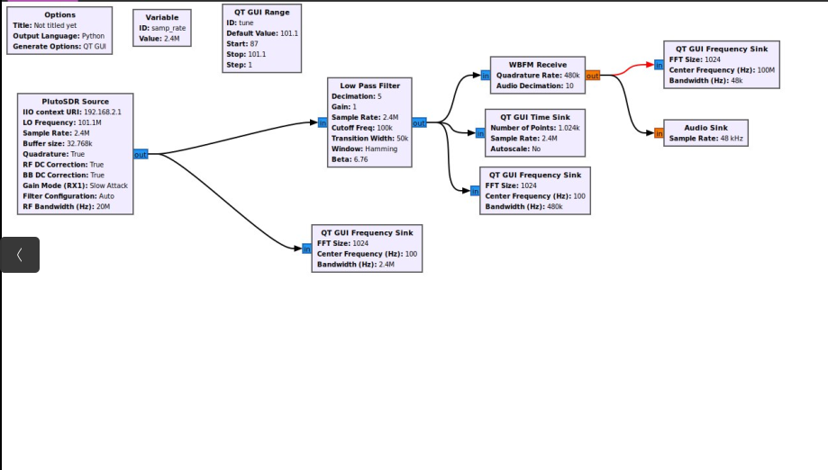

# Занятие 15 
## GNU Radio. Реализация FM-приемника, воспроизведение в real-time

**Задание**: 
- Хакнуть SDR

Перед тем как начать реализовывать радио приемник нужно "настроить" SDR для дальнейшей работы при помощи [данной статьи](https://humble-ballcap-e09.notion.site/nicoskin/PlutoSDR-6e3f0880417f4927895cffa93ca2cf50)

- Реализовать радио-приёмник в GNU Radio

Построенный радио-приемник

При помощи ползунка можно менять частоту 

Можно выбрать её из данного списка

Полученные графики:

Временной график

Частотный график выбранной радиостанции  

Частотный график (различные радиостанции)

