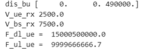

# Занятие 21
## Баллистика (наука о движении тел, брошенных в пространстве) и ее связь с GPS.

**Краткая теория:**

Баллистика — это наука, изучающая движение тел, которые были брошены или запущены в пространство под действием различных сил. Баллистика делится на несколько основных разделов:
1.	Внутренняя баллистика: изучает процессы, происходящие внутри ствола оружия, от момента воспламенения заряда до выхода снаряда из ствола.
2.	Переходная баллистика: исследует движение снаряда в промежутке от выхода из ствола до стабилизации полета.
3.	Внешняя баллистика: изучает движение снаряда в полете до момента попадания в цель.
4.	Конечная (терминальная) баллистика: исследует взаимодействие снаряда с целью и его поведение при ударе.
GPS (Global Positioning System) — это глобальная система навигации, использующая спутники для определения точного местоположения объектов на поверхности Земли.
Связь баллистики и GPS
Связь баллистики и GPS можно рассмотреть на нескольких уровнях:
1.	Определение координат запуска и цели:
o	Для точного расчета траектории полета снаряда необходимо знать начальные координаты и координаты цели. GPS обеспечивает высокую точность в определении этих координат, что существенно улучшает точность баллистических расчетов.
2.	Трекинг снаряда в полете:
o	Современные технологии позволяют интегрировать GPS-трекеры в снаряды или ракеты. Это позволяет отслеживать их траекторию в реальном времени и вносить корректировки в случае необходимости. Такая технология важна для управления высокоточным оружием и минимизации побочного ущерба.
3.	Калибровка и тестирование баллистических моделей:
o	GPS используется для сбора данных при тестировании новых баллистических моделей. Точные данные о траекториях снарядов, полученные с помощью GPS, позволяют корректировать и улучшать математические модели, описывающие движение снарядов.
4.	Навигация и управление ракетами:
o	В управляемых ракетах GPS играет ключевую роль в системе наведения. Современные ракеты оснащены GPS-модулями, которые позволяют корректировать их траекторию в полете, обеспечивая высокую точность попадания в цель.

**Задание**: 
- Посчитать частоту после DL, какую частоту нужно отправить на UL, если приёмник и передатчик в движении.

**Выполнение**

Полученный код:

```
U_bs = 7500 # м/с
U_ue = 2500 # м/c

F_dl = 15e9 # Гц
F_ul = 10e9 # Гц

coord_bs = np.array([0, 0, 5e5]) # м
coord_ue = np.array([0, 0, 1e4]) # м

dis_bu = np.array(coord_bs - coord_ue)
print('dis_bu',dis_bu)

U_ue_rx = U_ue*dis_bu[2] / (np.sum(dis_bu**2) ** 0.5)
U_bs_rx = U_bs*dis_bu[2] / (np.sum(dis_bu**2) ** 0.5)
print('V_ue_rx',U_ue_rx)
print('V_bs_rx',U_bs_rx)

dl_ue = F_dl * (1+(U_ue_rx + U_bs_rx) / 3e8)
ul_ue = F_ul * (1-(U_ue_rx + U_bs_rx) / 3e8)
print(f'F_dl_ue = {round (dl_ue,1): }') # ГЦ
print(f'F_ul_ue = {round (ul_ue,1): }') # Гц

```

Полученный результат:


