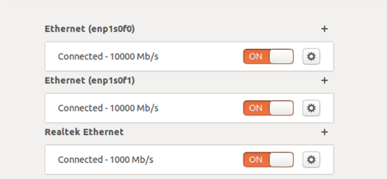

# Занятие 32, 34
## Open Source проект  LTE srsRan
## Анализ системных параметров из блоков SIB, конфигурация случайного доступа, настройки логгирования

**Запуск srsRAN 4G + USRP N310 + COST_UE**

**Требования к операционной системе**
ВАЖНО!! При установке Ubuntu, важно иметь только Английский\\English интерфейс. Языковой пакет можно добавить позже. Интерфейс должен быть на Английском!
Установка Low Latency ядра Ubuntu (18.04 LTS)
Ubuntu low-latency kernel, в основном, используется для внедряемых систем (embedded). Различие с Generic версией ядра заключается в:
- переводе ядра в режим preemtible. Позволяет прервать системные процессы с более низким приоритетом для выполнения процессов более высокого приоритета (даже если это system calls, за исключением critical section). Используется максимального значения CONFIG_PREEMPT. Данный режим рекомендуется использовать для desktop или embedded систем с требованиями к задержкам в пределах миллисекунд.
- использовании значения таймера CONFIG_HZ_1000, нежели HZ_250 в Generic версии Ubuntu. Данный таймер прерываний позволяет планировщику “прерывать” задачи с более высоким рейтом.
Переводим ядро в режим Low-latency:

```
sudo apt-get install linux-lowlatency linux-headers-lowlatency  linux-lowlatency-hwe-18.04
reboot
Результат установки Low-latency:
sudo uname -a
Linux ruslan-work 5.4.0-104-lowlatency #118~18.04.1-Ubuntu SMP PREEMPT Thu Mar 3 14:27:32 UTC 2022 x86_64 x86_64 x86_64 GNU/Linux
```

**Настройка сети. Доступ к USRP n310**

Схема подключения высокоскоростных портов (10 GE)


**Настройка сетевых портов**

Сетевые порты:



Настраиваем по порядку. Интерфейс - enp1s0f0:


Интерфейс - enp1s0f1:


Интерфейс – ethernet:


**USRP**
**SSH подключение к USRP n310**

```
ssh root@192.168.10.2
pass - usrpAccess1
```

**Настойка сетевых интерфейсов**

После SSH подключения настроить интерфейсы:

```
cd /data/network
ls -l 
```


- eth0 - интерфейс управления (management)
- sfp0 (10 Gbps) - интерфейс управления и передачи данных
- sfp1 (10 Gbps) - интерфейс управления и передачи данных

Ниже приведены примеры настройки данных интерфейсов.
Настройка интерфейса eth0:


Настройка интерфейса sfp0 (10 Gbps):


Настройка интерфейса sfp1 (10 Gbps):


Изменение настроек для каждого интерфейса соответственно:

```
nano eth0.network
nano sfp0.network
nano sfp1.network
```

**Установка UHD-драйвера, srsRAN**
**Установка UHD**

https://files.ettus.com/manual/ - официальная страница с документацией.

Установка пакетов, необходимых для сборки libuhd:

```
sudo apt-get install autoconf automake build-essential ccache cmake cpufrequtils doxygen ethtool g++ git inetutils-tools libboost-all-dev libncurses5 libncurses5-dev libusb-1.0-0 libusb-1.0-0-dev libusb-dev python3-dev python3-mako python3-numpy python3-requests python3-scipy python3-setuptools python3-ruamel.yaml
```

Клонируем исходники uhd с репозитория Ettus нужной нам ветки (пока рабочая UHD-4.1):

```
git clone -b UHD-4.1 <https://github.com/EttusResearch/uhd.git>
```

Собираем:

```
cd uhd/host/
mkdir build
cd build
cmake ../
make -j{n} # n - number of threads
make test # если нужно убедиться в правильности сборки
```

Устанавливаем и создаем линки для библиотеки libuhd:

```
sudo make install
sudo ldconfig
```

Проверка установленной версии:

```
uhd_config_info --print-all
```

Результат проверки:

```
UHD 4.1.0.6-120-g7e1ff96a
Build date: Thu, 02 May 2024 09:06:51
C compiler: GNU 9.4.0
C++ compiler: GNU 9.4.0
C flags: -DBOOST_ERROR_CODE_HEADER_ONLY -DBOOST_ASIO_DISABLE_STD_STRING_VIEW -DBOOST_ASIO_DISABLE_STD_EXPERIMENTAL_STRING_VIEW -DHAVE_CONFIG_H -DUHD_LOG_MIN_LEVEL=1 -DUHD_LOG_CONSOLE_LEVEL=2 -DUHD_LOG_FILE_LEVEL=2 -DUHD_LOG_CONSOLE_COLOR
C++ flags: -DBOOST_ERROR_CODE_HEADER_ONLY -DBOOST_ASIO_DISABLE_STD_STRING_VIEW -DBOOST_ASIO_DISABLE_STD_EXPERIMENTAL_STRING_VIEW -DHAVE_CONFIG_H -DUHD_LOG_MIN_LEVEL=1 -DUHD_LOG_CONSOLE_LEVEL=2 -DUHD_LOG_FILE_LEVEL=2 -DUHD_LOG_CONSOLE_COLOR -fvisibility=hidden -fvisibility-inlines-hidden
Enabled components: LibUHD, LibUHD - C API, LibUHD - Python API, Examples, Utils, Tests, USB, B100, B200, USRP1, USRP2, X300, MPMD, SIM, N300, N320, E320, E300, X400, OctoClock
Install prefix: /usr/local
Boost version: 1.71
Libusb version: 1.0.25
Library path: /usr/local/lib
Package path: /usr/local
Images directory: 
ABI version string: 4.1.0
```

**Установка\обновление UHD на USRP с помощью mender**

Mender позволяет удаленно, без физического подклчюения к “железу”, обновить файловую подсистему root (можно ознакомиться на офф. сайте Mender).
1) Для начала, необходимо скачать образы UHD на хосте, к которому подключен USRP:

```
sudo uhd_images_downloader -t mender -t n3xx --yes
```

2) Копируем их на USRP

```
scp /usr/local/share/uhd/images/usrp_n3xx_fs.mender  root@192.168.10.2:~/
```

3) Заходим на USRP:

```
ssh root@192.168.10.2
```
4) Устанавливаем загруженный артефакт *.mender:
ВАЖНО!!!!!!!!! после выполнения команды, НЕ трогать USRP и хост, иначе влетитье на круглую сумму.

```
mender -install /home/root/usrp_n3xx_fs.mender 
```

5) Дальше reboot:

```
reboot
```
6) Снова подключаемся к USRP:

```
ssh root@192.168.10.2
```

7) Наконец, необходимо применить изменения после установки, иначе они не применятся:

```
mender -commit
INFO[0000] Loaded configuration file: /var/lib/mender/mender.conf 
INFO[0000] Loaded configuration file: /etc/mender/mender.conf 
INFO[0000] Mender running on partition: /dev/mmcblk0p3  
INFO[0000] Update Module path "/usr/share/mender/modules/v3" could not be opened (open /usr/share/mender/modules/v3: no such file or directory). Update modules will not be available 
Committing Artifact...
INFO[0002] Committing update 
```

8) Проверка установленной версии на USRP:

```
cat /etc/mender/artifact_info 
uhd_config_info --version
root@ni-n3xx-3217891:~# cat /etc/mender/artifact_info 
artifact_name=v4.1.0.6-rc1_n3xx

root@ni-n3xx-3217891:~# uhd_config_info --version
UHD 4.1.0.HEAD-0-gc3fdc401
```

Изменение режима работы в Dual Gigabit Ethernet:
Для начала, необходимо скачать образы FPGA, из папки ```/usr/lib/uhd/utils``` запускаем:

```
sudo ./uhd_images_downloader.py
[INFO] Using base URL: <https://files.ettus.com/binaries/cache/>
[INFO] Images destination: /usr/share/uhd/images
[INFO] No inventory file found at /usr/share/uhd/images/inventory.json. Creating an empty one.
32419 kB / 32419 kB (100%) x4xx_x410_fpga_default-ge547a6b.zip
53458 kB / 53458 kB (100%) x4xx_x440_fpga_default-ge547a6b.zip
....
```

Здесь нам нужна папка в которую скачались образы FPGA, в данном случае это ```/usr/share/uhd/images```.
Необходимо сохранить этот путь в переменную окружения ```UHD_IMAGES_DIR```:

```
export UHD_IMAGES_DIR=/usr/share/uhd/images/
```

Если не сработало, то добавляем в конец файла переменных окружения вручную:

```
sudo nano /etc/environment 
# дальше добавить: UHD_IMAGES_DIR="/usr/share/uhd/images/"
```

Меняем режим работы на XG:
**‘XG’** - необходим для настройки двух 10GE интерфейсов и одного 1GE. Если настроить один 10GE и один 1GE, возникнут проблемы с **PRACH** каналом при попытке подключения телефона. Не будет проходить msg3.

```
uhd_image_loader --args="type=n3xx,addr=192.168.10.2,fpga=XG"
```

Увидим нечто подобное:

```
demo_user@srsran-4G:~/ruslan$ uhd_image_loader --args="type=n3xx,addr=192.168.10.2,fpga=XG"
[INFO] [UHD] linux; GNU C++ version 9.4.0; Boost_107100; UHD_4.1.0.6-120-g7e1ff96a
[INFO] [MPMD] Initializing 1 device(s) in parallel with args: mgmt_addr=192.168.10.2,type=n3xx,product=n310,serial=3217891,fpga=HG,claimed=False,skip_init=1
[INFO] [MPM.main] Launching USRP/MPM, version: 4.1.0.HEAD-gc3fdc401
[INFO] [MPM.main] Spawning RPC process...
[INFO] [MPM.PeriphManager] Device serial number: 3217891
[INFO] [MPM.PeriphManager] Initialized 2 daughterboard(s).
[INFO] [MPM.PeriphManager] init() called with device args `clock_source=internal,time_source=internal'.
[INFO] [MPM.RPCServer] RPC server ready!
[INFO] [MPM.RPCServer] Spawning watchdog task...
[INFO] [MPMD] Claimed device without full initialization.
[INFO] [MPMD IMAGE LOADER] Starting update. This may take a while.
[INFO] [MPM.PeriphManager] Installing component `fpga'
[INFO] [MPM.PeriphManager] Installing component `dts'
[INFO] [MPM.RPCServer] Resetting peripheral manager.
[INFO] [MPM.PeriphManager] Device serial number: 3217891
[INFO] [MPM.PeriphManager] Initialized 2 daughterboard(s).
[WARNING] [MPM.PeriphManager] Minor compat ahead of expected compat for component 'FPGA'. Expected: 8.0 Actual: 8.2
[INFO] [MPM.PeriphManager] init() called with device args `clock_source=internal,time_source=internal'.
[INFO] [MPMD IMAGE LOADER] Update component function succeeded.
[INFO] [MPMD] Initializing 1 device(s) in parallel with args: mgmt_addr=192.168.10.2,type=n3xx,product=n310,serial=3217891,fpga=XG,claimed=False,addr=192.168.10.2,find_all=1
[INFO] [MPM.PeriphManager] init() called with device args `find_all=1,fpga=XG,mgmt_addr=192.168.10.2,product=n310,clock_source=internal,time_source=internal'.
[WARNING] [UDP] The send buffer could not be resized sufficiently.
Target sock buff size: 2500000 bytes.
Actual sock buff size: 1048576 bytes.
See the transport application notes on buffer resizing.
Please run: sudo sysctl -w net.core.wmem_max=2500000
```

Дальше, выполняем:

```
sudo sysctl -w net.core.wmem_max=2500000
```

Проверка работоспособности USRP n310:

```
uhd_find_devices
```

После смены режима работы должны отображаться 3 интерфейса:

```
[INFO] [UHD] linux; GNU C++ version 9.4.0; Boost_107100; UHD_4.1.0.6-120-g7e1ff96a
--------------------------------------------------
-- UHD Device 0
--------------------------------------------------
Device Address:
    serial: 3217891
    addr: 192.168.11.2
    claimed: False
    fpga: XG
    mgmt_addr: 192.168.10.2
    mgmt_addr: 192.168.11.2
    mgmt_addr: 192.168.12.2
    product: n310
    type: n3xx
```

**Запуск eNodeB**

Запуск базовой станции 4G в режиме End-to-End Stand Alone.

```
cd srsRAN/srsenb/
sudo srsenb enb.conf
```

```
2024-05-23T10:33:03.687566 [RRC    ] [D] Content:
[
  {
    "UL-DCCH-Message": {
      "message": {
        "c1": {
          "rrcConnectionSetupComplete": {
            "rrc-TransactionIdentifier": 0,
            "criticalExtensions": {
              "c1": {
                "rrcConnectionSetupComplete-r8": {
                  "selectedPLMN-Identity": 1,
                  "dedicatedInfoNAS": "07417208991007000040396905f0f000001000290201d011d127218080211001000010810600000000830600000000000d00000a00001000001a0105c05c1004901103575886f15d0104c1"
                }
              }
            }
          }
        }
      }
    }
  }
]
2024-05-23T10:33:03.687584 [RRC    ] [I] RRCConnectionSetupComplete transaction ID: 0
2024-05-23T10:33:03.687616 [S1AP   ] [I] Tx S1AP SDU, InitialUEMessage, rnti=0x46
    0000: 00 0c 40 74 00 00 05 00 08 00 02 00 01 00 1a 00
    0010: 4c 4b 07 41 72 08 99 10 07 00 00 40 39 69 05 f0
2024-05-23T10:33:03.687653 [RRC    ] [D] Setting timer for UE inactivity for rnti=0x46 to 30000ms
2024-05-23T10:33:03.687653 [RRC    ] [D] Activity registered for rnti=0x46 (timeout_value=30000ms)
2024-05-23T10:33:03.687653 [RRC    ] [D] Activity registered for rnti=0x46 (timeout_value=30000ms)
2024-05-23T10:33:03.687875 [S1AP   ] [I] Rx S1AP SDU - DownlinkNASTransport
    0000: 00 0b 40 38 00 00 03 00 00 00 02 00 01 00 08 00
    0010: 02 00 01 00 1a 00 25 24 07 52 00 0a ac 67 38 f1
2024-05-23T10:33:03.687879 [S1AP   ] [I] Checking UE S1 logical connection. eNB UE S1AP ID=1, MME UE S1AP ID=1
2024-05-23T10:33:03.687886 [RRC    ] [I] Tx SRB1 PDU, rnti=0x46 - dlInformationTransfer (39 B)
    0000: 08 01 20 3a 90 00 55 63 39 c7 8e 73 ec 6b 0d 58
    0010: 09 44 bd 60 87 48 80 dc e7 6b 06 9b 8c 80 08 70
2024-05-23T10:33:03.687896 [RRC    ] [D] Content:
[
  {
    "DL-DCCH-Message": {
      "message": {
        "c1": {
          "dlInformationTransfer": {
            "rrc-TransactionIdentifier": 0,
            "criticalExtensions": {
              "c1": {
                "dlInformationTransfer-r8": {
                  "dedicatedInfoType": {
                    "dedicatedInfoNAS": "0752000aac6738f1ce7d8d61ab012897ac10e9101b9ced60d37190010e1dd45911270ed5"
                  }
                }
              }
            }
          }
        }
      }
    }
  }
]
```


