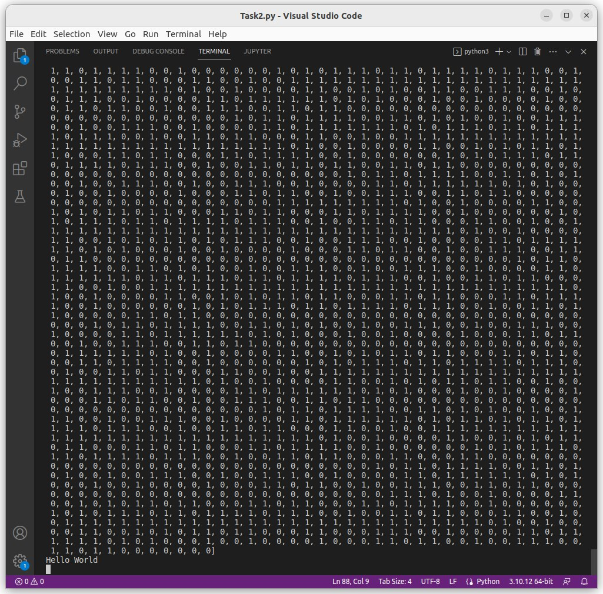
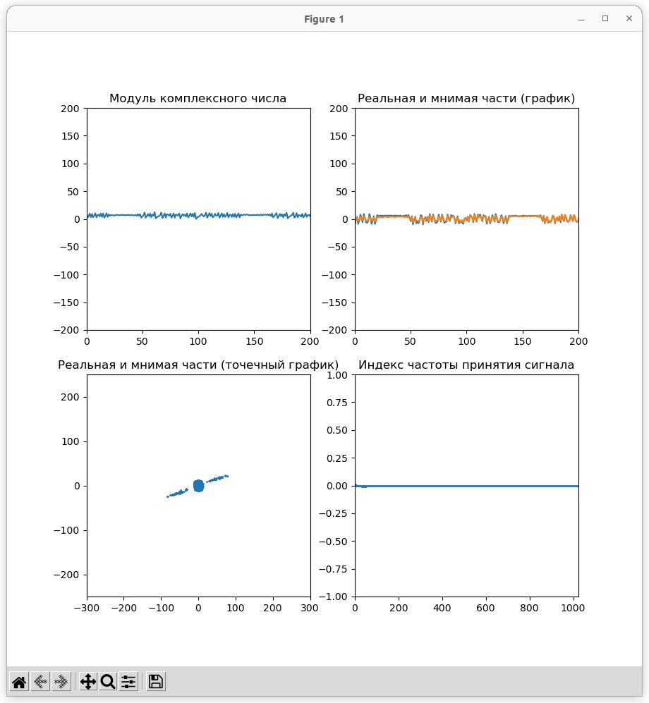

# Занятие 35 
## SDR-проект
## Разработка ПО для обеспечения дуплексной передачи на базе программно-конфигурируемого радио (SDR)

**Задание**: 
- Разработать ПО для обеспечения дуплексной передачи на базе программно-конфигурируемого радио (SDR)

**Выполнение**

Сообщение на отправку:

```
sync = "111111111111111111111111111111"
hello = "0100100001100101011011000110110001101111001000000101011101101111011100100110110001100100"
N = len(hello)
message = sync + hello
print("message: ", len(message))
```
Функции BPSK- модуляции:

```
def modulate_bpsk(bit_string):
    complex_array = np.array([], dtype = complex)
    n = int(len(bit_string))
    complex_array.resize( int(len(bit_string)) ) 
    i = 0
    while(n != 0):
        if(bit_string[i] =='1'):
            real = 1
            imag = 0
        else:
            real = -1
            imag = 0
        complex_array[i] = complex(real, imag)
        n -= 1
        i += 1

    return complex_array
```
Функции BPSK - демодуляции:

```
def demod_bpsk(iq):
    bitarray = []
    m = len(iq)
    i = 0
    while(m != 0):
        if(iq[i].real >= 0 ):
            bitarray.append(1)
        else:
            bitarray.append(0)
        m -= 1
        i += 1
    return bitarray
```

Демодулированные данные и полученное сообщение:



Графики на приеме:



Передача и прием прошли успешно!